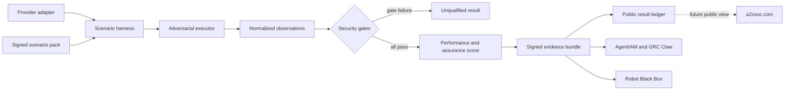

# Identity Fabric Benchmarks

[](https://github.com/AAH20/identity-fabric-benchmarks/actions/workflows/verify.yml)
[](LICENSE)

A vendor-neutral, adversarial benchmark and interoperability suite for human, workload, service, AI-agent, model, tool, device, robot, vehicle, and biometric-assertion identity.

The project tests a complete authority chain:

```text
principal -> delegation -> authorization -> privilege -> action -> evidence -> revocation
```

It is designed to answer whether an identity control plane prevents dangerous actions under attack and preserves enough evidence to explain every decision. It does not certify products in v0.1 and does not declare a winner without reproducible submitted evidence.

## Benchmark architecture



## Non-compensating score model

Security gates are pass/fail. Good latency cannot compensate for an unauthorized action, cross-tenant access, authority amplification, replay acceptance, missing approval, or failed revocation.

Only systems passing every mandatory security gate receive a numeric operational score:

```text
qualified = all mandatory security scenarios pass
score = 0.35 assurance + 0.25 resilience + 0.20 performance
      + 0.10 interoperability + 0.10 evidence quality
```

The v0.1 CLI validates the scenario pack and runs a deterministic reference adapter to prove the result contract. Real provider adapters must report observed results and attach evidence; self-reported marketing values are not benchmark results.

## Core benchmark families

| Family | Failure condition |
|---|---|
| Tenant isolation | Cross-tenant request is allowed |
| Delegation | Child obtains authority absent from its parent |
| Purpose binding | Credential is reused for a different purpose |
| Revocation | Revoked authority remains usable beyond the deadline |
| Privileged access | Required approval or session evidence is bypassed |
| RAG authorization | Restricted document content crosses an ACL boundary |
| Biometric assertion | Replayed or context-mismatched assertion is accepted |
| Physical AI | Robot action executes without attestation, readiness, or lease binding |
| Evidence | Decision cannot be reconstructed from immutable identifiers |
| Availability | Policy partition silently fails open |

## Run

```bash
python -m pip install -e .
identity-fabric-bench validate
identity-fabric-bench run --output reports/reference-result.json
python -m unittest discover -s tests -v
```

## Adapter roadmap

- Human identity: Entra ID, Okta, Ping, Keycloak and Auth0-compatible OIDC
- PAM and secrets: CyberArk, Delinea, BeyondTrust, OpenBao and Vault-compatible APIs
- Workloads: SPIFFE/SPIRE, Kubernetes and cloud workload identity
- Policy: OpenID AuthZEN, OPA/Rego and Cedar
- Agents: MCP, A2A and LangGraph execution context
- Data and RAG: object, row, column and document authorization
- Physical AI: ROS 2, MAVLink and Robot Black Box evidence
- Assurance: OpenTelemetry, OSCAL, in-toto-style attestations and GRC Claw

Names identify intended test targets and do not imply affiliation.

## Connected projects

- [AgentIAM Lab](https://github.com/AAH20/ai-agent-identity-authorization-security) defines the reference identity and authorization contracts.
- [Egypt Digital Trust Map](https://github.com/AAH20/egypt-digital-trust-map) applies the registry and integration methodology to Egypt.
- [GRC Claw](https://github.com/AAH20/GRC_Claw) maps evidence to governance controls.
- [Robot Black Box](https://github.com/AAH20/robot-black-box) supplies physical-action evidence.

## Future A2ZSOC integration

Signed benchmark results are designed for future read-only pages such as `a2zsoc.com/benchmarks`, `a2zsoc.com/providers`, and `a2zsoc.com/certification`. Those pages are roadmap items and are not implemented here.

## Responsible use

Run adapters only against systems you own or are explicitly authorized to test. Public results require reproducible evidence, environment disclosure, versioned scenarios, and a documented vendor response process.

## License

Apache-2.0. Standards and trademarks belong to their respective owners.
